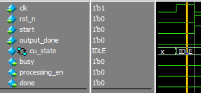
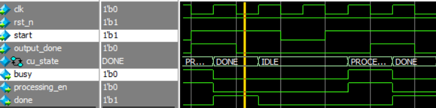
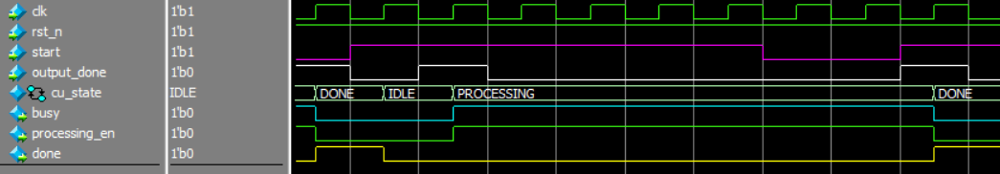
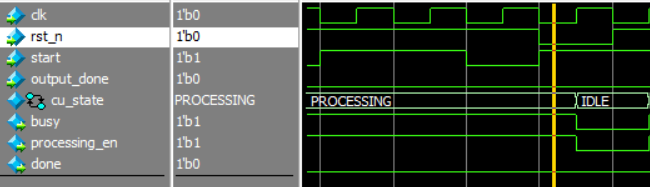
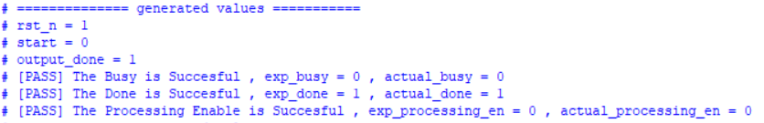
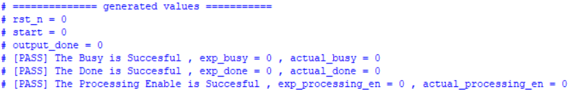

# global_ctrl — Unit Verification Evidence

This folder contains the verification evidence for the `global_ctrl` module:
functional test cases, coverage report, and waveform/log screenshots
captured from the simulation run.

- **Testbench location:** `tb/unit/global_ctrl/`
- **Covered test cases:** [`global_ctrl_covered_test_cases.txt`](./global_ctrl_covered_test_cases.txt)
- **Full coverage report:** [`coverage_global_ctrl_rpt.txt`](./coverage_global_ctrl_rpt.txt)
- **Result:** 100/100 transactions passed, 100% DUT branch/statement/FSM coverage, 100% functional covergroup coverage.

## Waveform Screenshots

### 1. Initial Reset
State at simulation start, before the FSM leaves `IDLE`. Confirms `busy`,
`done`, and `processing_en` are all held low while `rst_n = 0`.

### 2. Start Transition
`start = 1` is sampled while the FSM is in `IDLE`, driving the transition
`IDLE -> PROCESSING` on the next clock edge.

### 3. Processing State
FSM held in `PROCESSING`: `busy = 1` and `processing_en = 1` while
`output_done = 0`, confirming the module stays busy until told to finish.

### 4. Mid-Operation Start (start ignored while busy)
`start = 1` arrives again while the FSM is already in `PROCESSING`
(`busy = 1`). Confirms the extra start pulse is correctly ignored — the
FSM does not restart or glitch.

### 5. Mid-Operation Reset
`rst_n = 0` asserted while the FSM is in `PROCESSING` (`busy = 1`).
Confirms the FSM aborts immediately back to `IDLE` regardless of the
current state (the `mid_reset` cross-coverage bin).

### 6. Done State
`output_done = 1` is sampled in `PROCESSING`, driving the transition
`PROCESSING -> DONE`. `done = 1` is asserted for one cycle before
returning to `IDLE`.

### 7. Reset (general)
General reset behavior captured mid-simulation, confirming `cu_state`
returns to `IDLE` and all outputs de-assert whenever `rst_n = 0`.

