# output_formatter — Unit Verification Evidence

This folder contains the verification evidence for the `output_formatter`
module: functional test cases, coverage report, and waveform/log
screenshots captured from the simulation run.

- **Testbench location:** `tb/unit/output_formatter/`
- **DUT fix:** `dut/output_formatter.sv` was corrected as part of this
  branch (previous draft was incomplete / had saturation bugs).
- **Covered test cases:** [`covered_test_cases.txt`](./covered_test_cases.txt)
- **Full coverage report:** [`coverage_output_formatter_rpt.txt`](./coverage_output_formatter_rpt.txt)
- **Result:** 100/100 transactions passed, 100% DUT branch/condition/expression/statement/toggle coverage, 100% functional covergroup coverage.

Each functional case below has two screenshots: the waveform view, and
the corresponding simulation log (`*_log.png`) showing the `[PASS]`
messages for that transaction.

## Waveform & Log Screenshots

### 1. Valid = 0, Last = 0
Input transaction is invalid. Expected: `pixel_valid = 0`, `pixel_last = 0`.

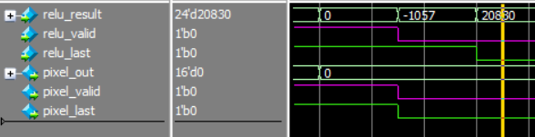
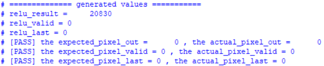

### 2. Valid = 0, Last = 1
Invalid transaction with `relu_last` asserted; `pixel_last` and
`pixel_valid` must still read 0 since `relu_valid = 0`.

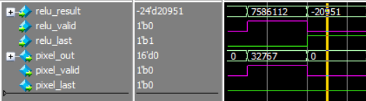
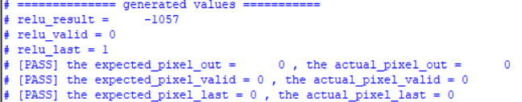

### 3. Valid = 1, Last = 0
Valid transaction, not the last pixel. Expected: `pixel_valid = 1`,
`pixel_last = 0`.

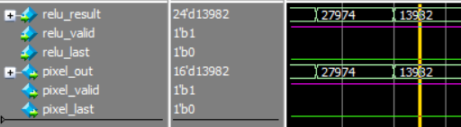
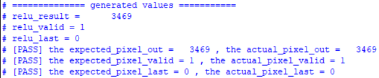

### 4. Valid = 1, Last = 1
Valid transaction marking the last pixel of the row/frame. Expected:
`pixel_valid = 1`, `pixel_last = 1`.

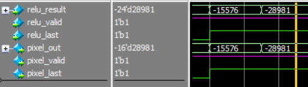
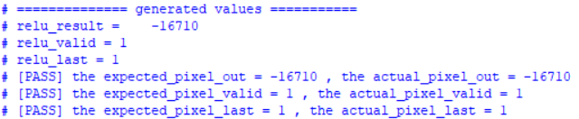

### 5. Zero Input
`relu_result = 0`. Expected: `pixel_out = 0` (pass-through, no saturation).

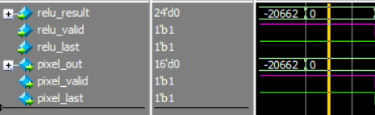
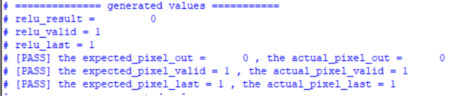

### 6. Max Positive Boundary
`relu_result` at the exact upper saturation boundary
(`MAX_OUT = 24'sh007FFF`). Expected: `pixel_out = 16'sh7FFF`, no
saturation triggered since the value fits exactly.

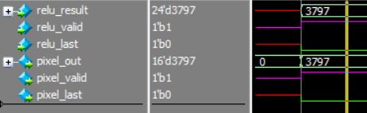
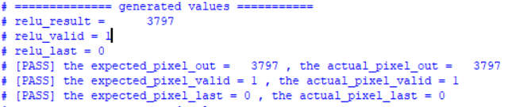

### 7. Min Negative Boundary
`relu_result` at the exact lower saturation boundary
(`MIN_OUT = 24'shFF8000`). Expected: `pixel_out = 16'sh8000`, no
saturation triggered since the value fits exactly.

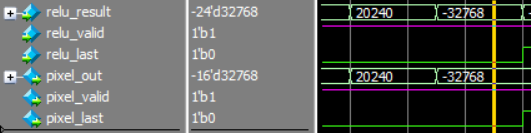
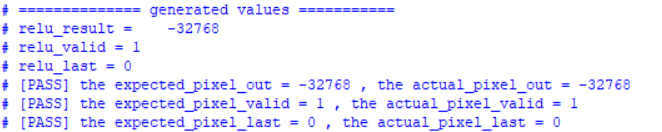

### 8. In-Range Positive
Positive `relu_result` within the representable `OUT_W` range.
Expected: `pixel_out = relu_result` (direct pass-through, no saturation).

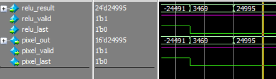
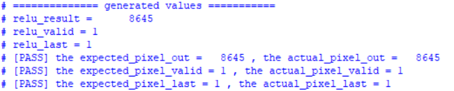

### 9. In-Range Negative
Negative `relu_result` within the representable `OUT_W` range.
Expected: `pixel_out = relu_result` (direct pass-through, no saturation).

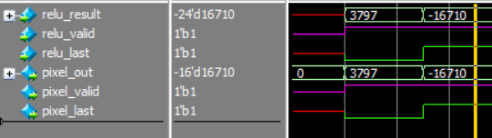
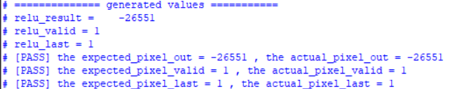

### 10. Out-of-Range Positive (Upper Saturation)
Positive `relu_result` exceeding the `OUT_W` range. Expected:
`pixel_out = MAX_OUT` (saturates to `16'sh7FFF`).

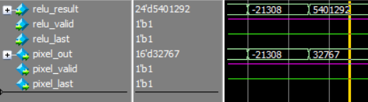
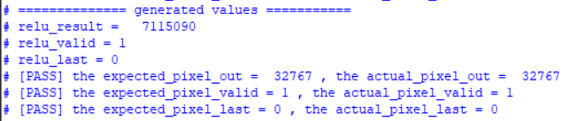

### 11. Out-of-Range Negative (Lower Saturation)
Negative `relu_result` exceeding the `OUT_W` range. Expected:
`pixel_out = MIN_OUT` (saturates to `16'sh8000`).

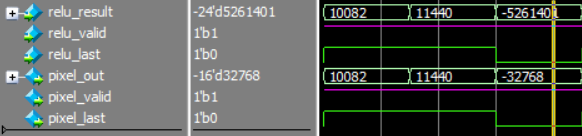
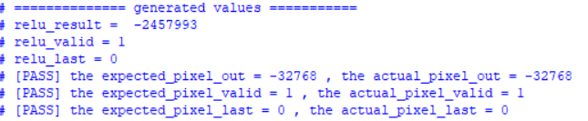
